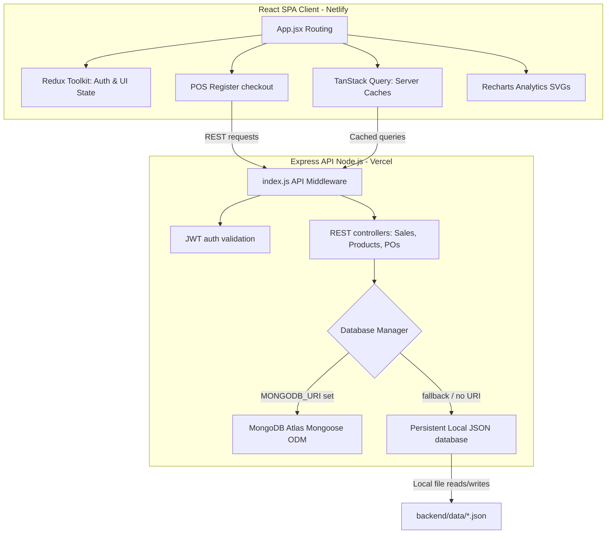

# 📦 Precision Ledger — Full-Stack Inventory & Sales Journal

<div align="center">
  <p><strong>A premium Swiss-financial instrument meets a craftsman's workshop ledger.</strong></p>
  <p>Designed for artisan retail shopkeepers who demand absolute visual clarity and bookkeeping authority.</p>
  <p>
    <a href="https://precision-ledger-2051.netlify.app" target="_blank"><strong>🚀 Live Frontend Website</strong></a>
    &nbsp;&bull;&nbsp;
    <a href="https://backend-two-snowy-22.vercel.app" target="_blank"><strong>⚡ Live Backend API</strong></a>
    &nbsp;&bull;&nbsp;
    <a href="https://plinth-spatial.netlify.app" target="_blank"><strong>🪨 Plinth Social Platform</strong></a>
  </p>
</div>

---

# 🏛️ System Architecture Diagram

Below is the design outline of the **Precision Ledger** monorepo layout, illustrating client state controls and the dynamic local file persistence fallback:



---

# ✨ Signature Design Language & Visual Aesthetics

Precision Ledger is crafted following a strict, editorial **"Precision Ledger"** theme. Every element is bespoke and avoids generic template layouts:

- **Swiss Color Palette:** 
  - `Deep Navy` (#1A2B4A) for structural panels and authority.
  - `Burnt Amber` (#E07B39) accents for CTAs, focus rings, and transaction cues.
  - `Warm Gray/Dividers` (#E4E2DC) and `Off-white` (#FAFAF8) ledger surfaces.
- **Handcrafted Accents:**
  - **Left Row Indicators:** Hovering over data tables draws a solid `3px Burnt Amber` left border on rows with smooth transitions.
  - **Diagonal Texture Overlays:** KPI summary cards feature subtle radial grid dot overlays to mimic fine ledger papers.
  - **Typographic Hierarchy:** Page headers render in bold *Playfair Display* serif, labels in *Inter* sans-serif, and financial currency grids in monospaced *JetBrains Mono*.
- **Tactile Micro-interactions:** Staggered list fade-ins, pulsating low stock warning badges, and custom SVG path-drawn success checkmarks.

---

# ⚙️ Monorepo Features Matrix

| Feature | Description | Security / Spec |
| :--- | :--- | :--- |
| **Point of Sale (POS)** | Search items with stock constraints, calculate running totals (GST tax 8.25%, discounts), and checkout. | In-Memory Transaction Buffering |
| **A4 Invoices** | Print-optimized invoice layout that hides controls and yields clean white physical receipts. | CSS Media Queries Print Directives |
| **Suppliers & POs** | Manage wholesale distributors and mark purchase orders as "Received" to auto-increment stock. | Ledger Stock Movement Records |
| **Returns Log** | Lodge customer or supplier returns and select damage reasons to auto-adjust inventory. | Audited Movement logs |
| **Profit & Loss** | Formal P&L ledger sheet tracking gross revenues, COGS (cost of goods sold), and operational net profit. | Accountant-Style Aggregation |
| **Global Search** | Multicast typeahead search box looking up products, suppliers, and invoice logs simultaneously. | Debounced Client-Side Indexing |

---

# 📂 Project Directory Map

```text
CODE-A-NOVA/
├── backend/
│   ├── src/
│   │   ├── config/       # db.js (Mongoose + local JSON DB Fallback)
│   │   ├── controllers/  # auth, products, transactions, reports, settings
│   │   ├── middleware/   # JWT verification & role authorization guards
│   │   ├── models/       # Mongoose schemas (User, Shop, Product, PO, Sales, returns)
│   │   ├── routes/       # Express route handlers mapping API endpoints
│   │   └── index.js      # App entry point & mock database seeding engine
│   └── .env              # Server configurations
├── frontend/
│   ├── src/
│   │   ├── api/          # Axios instance + automatic JWT silent refreshes
│   │   ├── components/   # layout (Sidebar & Header), modals (Alert/Confirm)
│   │   ├── pages/        # public views (Home, About, Services) & dashboard panels
│   │   ├── store/        # Redux Toolkit global state store
│   │   ├── styles/       # Tailwind directive mappings & CSS variable sheets
│   │   └── App.jsx       # Client router mappings & providers
│   ├── tailwind.config.js
│   └── index.html        # Title and meta descriptors SEO configuration
└── .gitignore            # Monorepo git exclusion mappings
```

---

# 🚀 Local Installation & Startup Guide

Follow these steps to spin up the local server and client node.

## Prerequisites
- Node.js (v20+ recommended)
- npm (v10+ recommended)

## 1. Setup Backend Server
```bash
# Navigate to the backend directory
cd backend

# Install dependencies
npm install

# Start the dev server
npm start
```
*Note: The server automatically falls back to storing data inside `backend/data/*.json` and seeds default credentials:*
- **Demo Admin Email:** `admin@precisionledger.com`
- **Demo Admin Password:** `password123`

## 2. Setup Frontend Client
```bash
# Navigate to the frontend directory
cd ../frontend

# Install dependencies with legacy peer resolutions (React 19 support)
npm install --legacy-peer-deps

# Spin up Vite dev server
npm run dev
```
Open **[http://localhost:5175/](http://localhost:5175/)** in your browser. Click the **One-Click Demo Login** button on the portal to access the dashboard.

---

## 🚀 Live Deployments

- **Frontend Website (Hosted on Netlify):** [https://precision-ledger-2051.netlify.app](https://precision-ledger-2051.netlify.app)
- **Backend API Server (Hosted on Vercel):** [https://backend-two-snowy-22.vercel.app](https://backend-two-snowy-22.vercel.app)

---

## ☁️ Deployment Configurations

### Backend Deployment (Vercel)
The backend project root contains a Vercel routing manifest inside `backend/vercel.json`:
```json
{
  "version": 2,
  "builds": [{ "src": "src/index.js", "use": "@vercel/node" }],
  "routes": [{ "src": "/(.*)", "dest": "src/index.js" }]
}
```

### Frontend Deployment (Netlify)
The frontend uses client-side routing configured in `frontend/netlify.toml`:
```toml
[[redirects]]
  from = "/*"
  to = "/index.html"
  status = 200

[build]
  publish = "dist"
  command = "npm run build"
```

